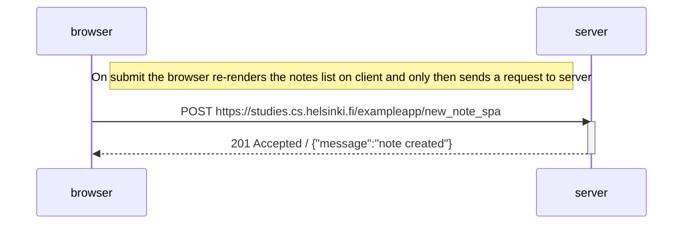

```mermaid
sequenceDiagram
  participant browser
  participant server
  
  Note right of browser: On submit the browser re-renders the notes list on client and only then sends a request to server
  
  browser->>server: POST https://studies.cs.helsinki.fi/exampleapp/new_note_spa
  activate server
  server-->>browser: 201 Accepted / {"message":"note created"}
  deactivate server
```
